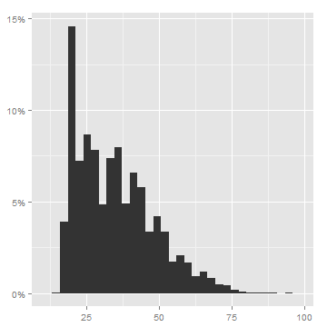
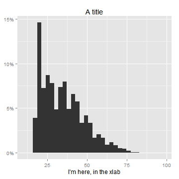
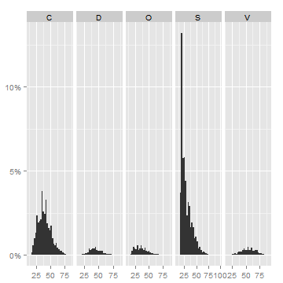
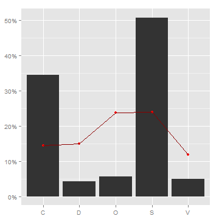
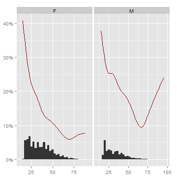

## shoRtcut

shoRtcut is an R package to make the life with R even more easier.

### Installation

You can install `shoRcut` from `github` using the `devtools` package.


```r
library(devtools)
install_github("shoRtcut", "jbkunst")
library(shoRtcut)
```


### Some functions in the package ShoRtcut


#### Exporting tables

The function `writetable` requires the name (relative or full path) of the file with the extension and the `data.frame` to export. Also support `json` format.


```r
data(iris)

t1 <- cbind(head(iris, 3), from = "excel")
t2 <- cbind(tail(iris, 3), from = "text")
t3 <- cbind(head(iris, 3), other_from = "json")

writetable(t1, "excel_file.xlsx")
writetable(t2, "txt_file.txt")
writetable(t3, "json_file.json")
```


```r
data(mtcars)
writetable(mtcars, "file.json")
```


#### Reading tables

The function `readtable` require the names of files to read. You can read simoultaneus files. This function not necessary require all tables with the same number columns because use the `rbind.fill` function in the `plyr` package.


```r
table <- readtable(files = c("excel_file.xlsx", "txt_file.txt"))
table <- readtable(files = c("json_file.json"))
table
```

```
##   Sepal.Length Sepal.Width Petal.Length Petal.Width Species other_from
## 1          5.1         3.5          1.4         0.2  setosa       json
## 2          4.9         3.0          1.4         0.2  setosa       json
## 3          4.7         3.2          1.3         0.2  setosa       json
```


#### Frequency table

The function `freqtable` return a `data.frame` with the information of the counts of the levels of variable.


```r
data(credit)
freqtable(credit$marital_status)
```

```
##   category  freq cumfreq relfreq cumrelfreq
## 1        C 17097   17097 0.34405     0.3440
## 2        D  2142   19239 0.04310     0.3871
## 3        O  2776   22015 0.05586     0.4430
## 4        S 25249   47264 0.50809     0.9511
## 5        V  2430   49694 0.04890     1.0000
## 6    Total 49694      NA 1.00000         NA
```

```r
freqtable(credit$marital_status, add.total = FALSE)
```

```
##   category  freq cumfreq relfreq cumrelfreq
## 1        C 17097   17097 0.34405     0.3440
## 2        D  2142   19239 0.04310     0.3871
## 3        O  2776   22015 0.05586     0.4430
## 4        S 25249   47264 0.50809     0.9511
## 5        V  2430   49694 0.04890     1.0000
```

```r
freqtable(credit$residence_type, sort.by.count = TRUE, pretty = TRUE)
```

```
## Loading required package: scales
```

```
##   category   freq cumfreq relfreq cumrelfreq
## 4        P 37,013  49,694   74.5%      74.5%
## 1        A  6,326   6,326   12.7%      87.2%
## 2        C  4,323  10,649    8.7%      95.9%
## 3        O  2,032  12,681    4.1%     100.0%
## 5    Total 49,694      NA  100.0%        NA%
```


This function also make a cross table if `variable2` argument is given.


```r
freqtable(credit$marital_status, credit$residence_type)
```

```
##   categories    A    C    O     P Total.row
## 1          C 1934  255  556 14352     17097
## 2          D  321   79   99  1643      2142
## 3          O  435  101  143  2097      2776
## 4          S 3375 3872 1160 16842     25249
## 5          V  261   16   74  2079      2430
## 6  Total.col 6326 4323 2032 37013        NA
```

```r
freqtable(credit$marital_status, credit$residence_type, add.total = FALSE, pretty = TRUE)
```

```
##   categories      A      C      O      P
## 1          C  1,934    255    556 14,352
## 2          D    321     79     99  1,643
## 3          O    435    101    143  2,097
## 4          S  3,375  3,872  1,160 16,842
## 5          V    261     16     74  2,079
```


#### Plot functions

There are shortcuts functions to plot distributions of variables based on `ggplot2` package.


```r
data(credit)
plot_dist(credit$marital_status)
```


```r
plot_dist(credit$age) + ggtitle("A title") + xlab("I'm here, in the xlab")
```

  


You can also split the plot according a new variable.

```r
plot_dist(credit$age, split = credit$marital_status)
```

  


Or even show a bivariate (1 or 0) response variable:

```r
plot_dist(credit$marital_status, indicator = credit$bad)
```

  

```r

credit <- subset(credit, sex %in% c("F", "M"))
plot_dist(credit$age, indicator = credit$bad, split = credit$sex)
```

  


#### Other functions
There are other functions and others in development:
* str_left
* str_rigth
* str_capitalize
* str_clean
* str_first_upper
* str_is_email
* str_pattern
* truncate
* plot_pie
* plot_pareto
